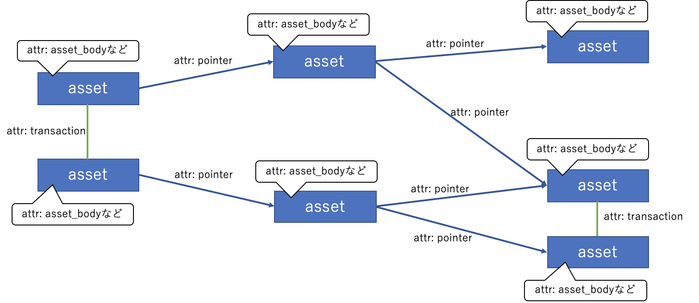

Graph DB adaptation of bbclib
========

This project aims at adapting BBc-1 transaction data model to a graph database. Here, we choose [Neo4j](https://neo4j.com) for the graph database implementation.

Documents are in the [docs directory](./docs). At this point, the document is written in Japanese. (translation is welcome!)

# Target

We see transactions data structure as like follows:

An asset is a node of the graph, and the attribute of the node is an asset_body. A relationship is expressed by an edge of the graph, which includes two cases: (1) the linked assets are stored in the identical transaction, (2) a pointer points a transaction and an asset.

We use Neo4j to express the above idea.

