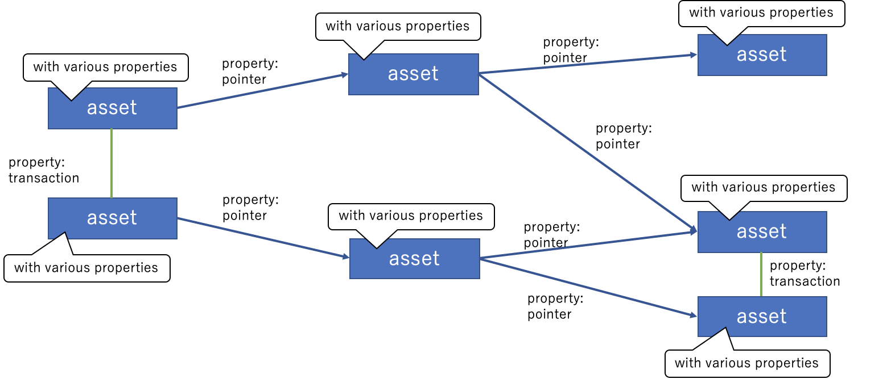

Graph DB adaptation of bbclib
========

This project aims at adapting BBc-1 transaction data model to a graph database. Here, we choose [Neo4j](https://neo4j.com) for the graph database implementation.

Documents are in the [docs directory](./docs). At this point, the document is written in Japanese. (translation is welcome!)

# Target

We see transactions data structure as like follows:

An asset is a node of the graph, and the attribute of the node is an asset_body. A relationship is expressed by an edge of the graph, which includes two cases: (1) the linked assets are stored in the identical transaction, (2) a pointer points a transaction and an asset.

We use Neo4j to express the above idea.

# Key concept

## グラフDBはトランザクション本体は管理せず、メタ情報のみを管理する

* 大きなバイナリデータとグラフDBの相性が悪い
  * https://neo4j.com/blog/dark-side-neo4j-worst-practices/
* トランザクションが改ざんされていないかどうかはグラフDBでは判断できないので、トランザクション本体を検証するしかない
* メタ情報はトランザクション本体からいつでも（誰でも）作成・再生できる
  * 作成するときに署名検証を行うこと
* メタ情報にどこまでの情報を含めるかは実装次第

## トランザクション本体はDB（TXDB）に格納する

* transaction_idとtransaction_dataの紐付けだけでいいので、性能重視のDB実装を利用すればいい

* TXDBだけはしっかり保全しなければならない

##Scheme to generate meta information of BBcTransaction

TXDBからトランザクションを取得して、後からメタ情報を生成してもよい。

アセットの中身（asset_body）を与えて、トランザクションとメタ情報の両方を一挙に生成する機能があってもよい

## Basic system structure

